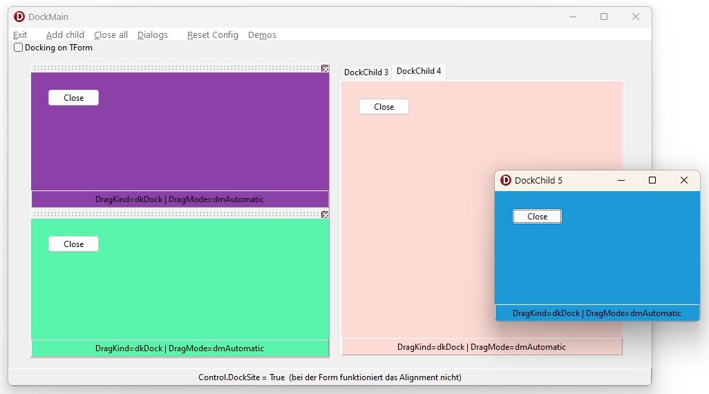
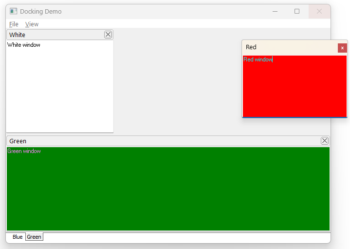
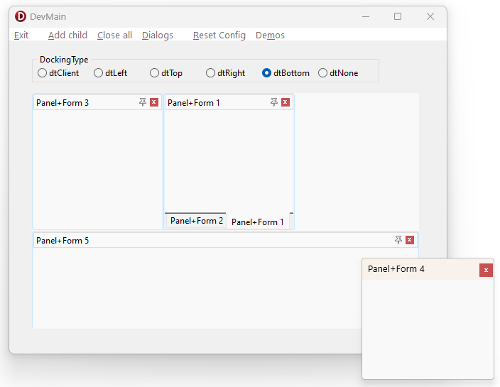
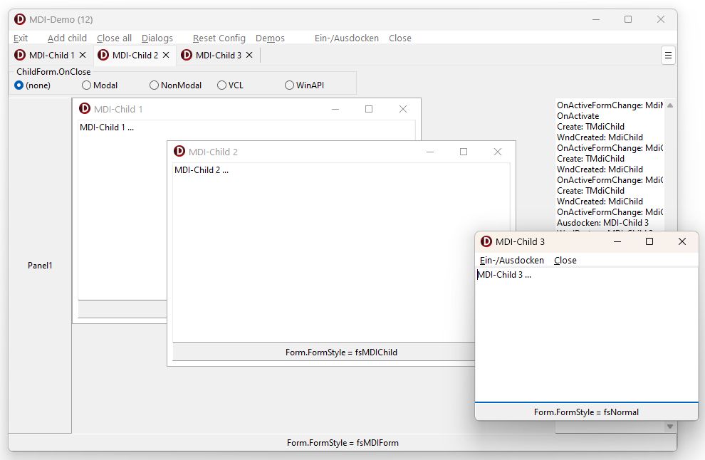
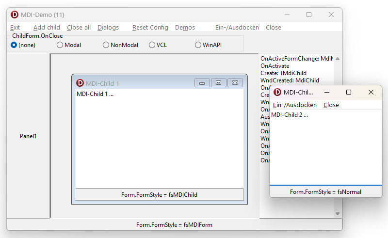

# Demos
* MDIDemo11.dpr/.exe - up to Delphi 11
* MDIDemo12.dpr/.exe - since Delphi 12 https://blogs.embarcadero.com/3-x-12-vcl-enhancements-in-delphi-12/
* DockDemo.dpr/.exe  - Property DockSite and DragKind
* DevExDock.dpr/.exe - DevExpress (TdxDockingManager, TdxDockSite and TdxDockPanel)
* DockDemoW.dpr/.exe - Walibeiro (TFormDockable)

## bekannte Probleme (DevExpress)
* dtMone und mehr als ein dtClient : der neue Child ist nicht sichtbar
* erneut eindocken ist immer maximiert (fast wie dtClient)

## bekannte Probleme (DockSite/DragKind)
* die eingedockte Titelleiste ist Scheiße
* während des Drag&Drop ist der Rahmen oft nicht sichtbar
* Form.DockSite nicht nutzbar 
  * eingedockte Forms theoretisch frei positionierbar
  * sie lassen sich aber nicht mehr ausdocken oder verschieben
  * und es gibt nur in Panels einen Schließen-Knopf (nicht auf Form oder in TPageControl)

## bekannte Probleme (Walibeiro)
* beim Kombinieren/Übereinanderlegen mit eingedockter Form wird der DockHost/TabGroup ausgedock
* beim Ausdocken von eines DockHost/TabGroup verschwindet das oftmals
* beim Eindocken eines DockHost/TabGroup werden manchmal die Tabs verdoppelt (untereinander)
* beim Drag&Drop einer Gruppe funktioniert das Transparente manchmal nicht (stattdessen nur noch der flackernde Rahmen)

## Screenshots

* DockSite

  

* walibeiro

  

* DevExpress

  

* MDI (seit Delphi 12)

  

* MDI (bis Delphi 11)

  
